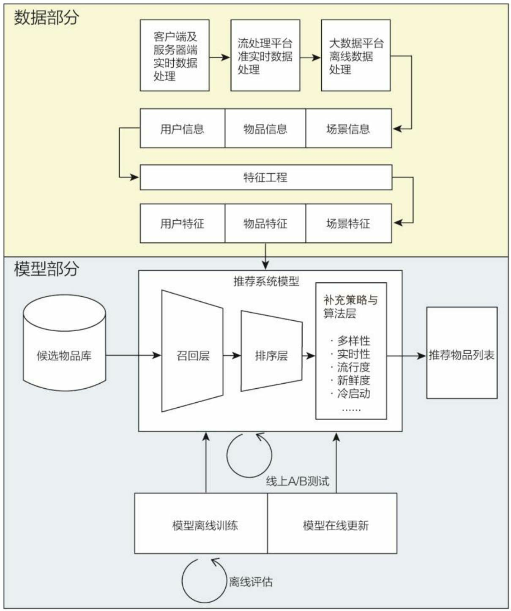
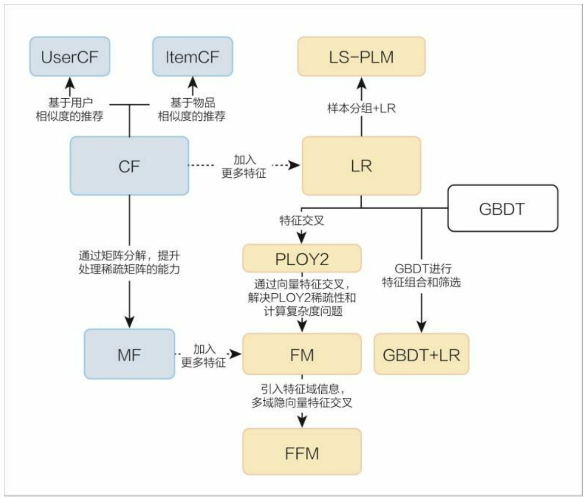
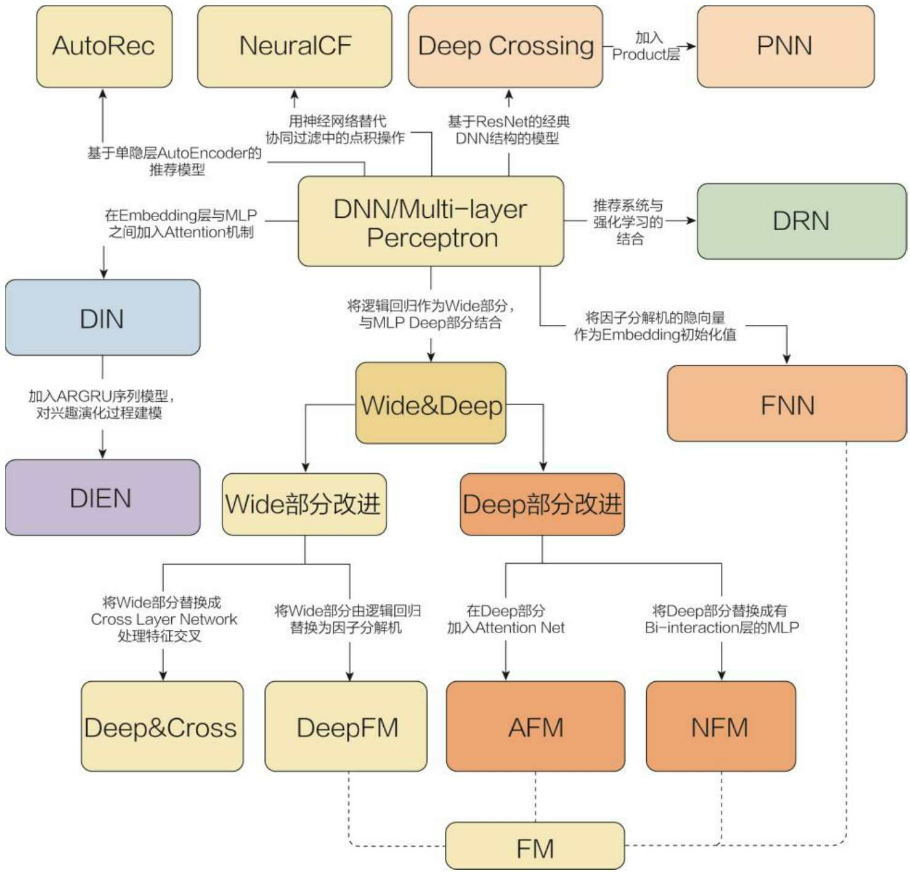

# LectureNotes_for_Recommendation_System
Lecture Notes for Recommendation System Algorithms

<p align="center">
    <a href="https://github.com/elegantcoin/LectureNotes_for_Recommendation_System"></a>
    <a href="https://github.com/python/cpython"></a>
    <a href="https://github.com/elegantcoin/LectureNotes_for_Recommendation_System"></a>
    <a href="https://opensource.org/licenses/mit-license.php"></a>
    <a href="https://github.com/elegantcoin/LectureNotes_for_Recommendation_System/stargazers"></a>
    <a href="https://github.com/elegantcoin/LectureNotes_for_Recommendation_System/network/members"></a>
    <a href="https://www.python.org/"></a>
</p>
<br />


## :fire: 1.常用到的库、模型、数据集等
序号| 库、模型/数据集 | 链接
------|------|------
1.|Scikit-Learn(Sklearn) |https://github.com/scikit-learn/scikit-learn (https://www.cntofu.com/book/170/index.html)
2.|Spark MLlib |https://spark.apache.org/docs/latest/ml-guide.html
3.|TensorFlow |https://github.com/tensorflow/tensorflow （https://www.tensorflow.org/api_docs/）
4.|libffm |https://github.com/ycjuan/libffm
5.|fastFM |https://github.com/ibayer/fastFM
6.|gcforest深度森林 |https://github.com/kingfengji/gcForest
7.|xLearn|https://github.com/aksnzhy/xLearn （https://xlearn-doc.readthedocs.io/en/latest/）
8.|XGBoost|https://github.com/dmlc/xgboost （https://xgboost.readthedocs.io/en/latest/）
9.|Million Song Dataset（MSD数据集） |http://millionsongdataset.com/
10.|Yahoo Movies公开音乐数据集|https://webscope.sandbox.yahoo.com
11.|Outbrain 点击率数据|https://www.outbrain.com
12.|Amazon product data亚马逊|http://jmcauley.ucsd.edu/data/amazon/index.html
13.|github daicoolb整理的推荐数据集|https://github.com/daicoolb/RecommenderSystem-DataSet

## :fire: 2.推荐系统的主要流程
___

___


- 推荐系统重要的3个模块
    - 召回模块：物品太多（数以亿计），需要挑选（~100），线上需要快速查询（不超过**100毫秒**）
    - 排序模块：对后选集精排，特征交叉，评分，更加精确的预测，TOPk
    - 后排模块：最终给到用户前的调整，运行干预、优先级调整、下发规则、多样性、实时性、流行度、新鲜度、冷启动等

    - 实时数据处理、流平台、大数据平台、离线训练、在线更新、离线评估、A/B测试
- 推荐系统的主要元素
    - 物品集合：
    - 用户：基本信息、行为、兴趣爱好
    - 场景：网络环境、时间等
    - 推荐引擎：学习用户喜欢什么物品的模型
    - 推荐结果集：一般是排序的集合

## :fire: 3.推荐系统的主要算法

- 召回模型算法
    - 内容相似：word2vec、LDA、FastText、LSF-SCNN、LSTM
    - 行为相似：ItemCF、UserCF、关联规则
    - 深度学习：DNN
- 排序模型算法
    - 线性：LR、FM、特征交叉+LR/FM
    - 非线性：DNN、Wide&Deep（Google play）、FNN、PNN、DeepFM（华为诺亚方舟）、NFM、AFM、DCN、DIN（阿里）
    - 树模型：决策树、随机森林、GBDT、XGBoost、GBDT+LR
    - 集成学习：数类型集成、GCForest

## :fire: 4.常见优化方法
- 梯度法（一阶导）：
    - SGD：适应数量大的数据集，容易陷入局部最优 θ = θ -εg
    - 动量：方向加速度，抑制震荡，  v = αv-εg，θ = θ + v
    - Nesterov动量：提高灵敏度，先临时更新θ，再更新速度，更新θ。
    - AdaGrad：计算累积平方梯度，适合处理稀疏梯度。
    - Adam：利用有偏一阶矩、二阶矩，参数平稳，使用大数据集和高维、非凸优化
    
- 牛顿法（二阶导，海森矩阵）：
    - L-BFGS：计算Hessian矩阵的逆，收敛速度快，但是消耗内存。对初始值有要求，容易陷入鞍点。
- 拟牛顿法：


TODO List：
## :fire: 5.推荐系统历史进展梳理
- **历史**
    - 1992，`施乐公司``David Goldberg`创建了邮件协同过滤系统
    - 1997，`Resnick`提出 “推荐系统”一词
    - 1998，`亚马逊` 上线协同过滤
    - 2001，`IBM` Websphere增加个性化推荐
    - 2003，`Google` 开创了AdWords模式，2007，添加个性化元素
    - 2006，`Netflix` 电影推荐算法竞赛的`矩阵分解`技术
    - 2007，`雅虎` SmartAds 广告方案
    - 2007，`ACM` 第一届推荐系统大会
    - 2010, `Steffen Rendle`在CTR预测竞赛中提出`FM`模型
    - 2015，`Facebook` 公布其推荐系统`GBDT+LR`原理
    - 2016，`Youtube` 公布其视频推荐系统
    - 2016，`Google` 公布App商店推荐系统`Wide & Deep`（双塔深度学习）
    - 2017，`华为` 诺亚方舟团队在IJCAI上推出`DeepFM`
    - 2017，`阿里巴巴` 推出`DIN`，后续`DIEN`，`MIMN`，`ESSM`模型
    - 2017，`京东` 推出深度强化学习模型,v3(2019)
```
(主要3个节点，`2010`年前协同过滤、逻辑回归；->>> `2010-2015`年因子分解机、梯度提升树；->>>`2015`年后深度学习单一到组合的架构模型)
```
Bandit、BPR、CMN、DIEN、DKN、DMF、DSIN、Evaluation-metrics、FTRL、IRGAN、MKR、[MLR](https://arxiv.org/pdf/1704.05194.pdf)、NAIS、NCF、RippleNet、SRGNN、XDeepFM、[GBDT+LR](http://quinonero.net/Publications/predicting-clicks-facebook.pdf)、LR、FM、FFM、FNN、[PNN](https://arxiv.org/pdf/1611.00144)（IPNN、OPNN、PNN*）、[NFM](https://arxiv.org/abs/1708.05027)、[AFM](https://www.comp.nus.edu.sg/~xiangnan/papers/ijcai17-afm.pdf)、[Wide ＆ Deep](https://dl.acm.org/citation.cfm?id=2988454)、[DeepFM](https://arxiv.org/abs/1703.04247)、[DCN](https://arxiv.org/pdf/1708.05123)、[DIN](https://arxiv.org/abs/1706.06978)、[LinUCB](https://arxiv.org/pdf/1003.0146.pdf)、[ESSM](https://arxiv.org/abs/1804.07931)
___

___


## :fire: 6.协同过滤算法
- 优缺点：
    - 协同过滤直观、可解释性强
    - 不具备较强的泛化能力，处理稀疏向量的能力弱
    - 矩阵分解相较于协同过滤，有更强的泛化能力，因为影响量的生成过程实际是全局拟合的过程，拥有全量信息。

- 相似度计算：
    - 同现相似度
    - 欧几里得距离
    - 皮尔逊相关系数
        - 皮尔逊相关系数通过使用用户平均分对各独立评分进行修正，减小了用户评分偏置的影响。
    - Cosine相似度
    - Tanimoto系数
## :fire: 7.Word2vec算法
- Embedding

- TODO

## :fire: 8.线性的LR模型
- 优缺点：
    - 利用用户行为等多种特征，多特征融合，更加全面
    - 数学上的支撑，假设因变量服从伯努利分布
    - 解释性强，特征加权和衡量不同特征的影响，权重代表特征重要程度，sigmoid映射到0~1范围
    - 工程化需要，易于并行、训练开销小
    - 但是，无法进行特征交叉、特征筛选，造成信息损失。`辛普森悖论`


## :fire: 9.线性的FM/FFM模型
- 因子分解机（Factorization Machine,FM）
    - 优缺点：
        - 训练开销相对小，泛化能力提高，线上推断简单，
        - 

    - `one-hot编码`：域中每个维度占有一个位，特征含有某个维度，对应位为1，其余位为0.（霍夫曼编码压缩空间，简单123...编码会导致同域特征相似度不一致）
    - 用向量内积项取代了`POLY2`的暴力两两特征交叉权重系数。
    - 将矩阵分解的单纯用户、物品隐向量扩展到了所有特征上。
- FFM（Field-aware Factorization Machine）
    - 优缺点：
        - 引入了特征域，引入更多有价值信息，模型表达能力变强
        - 但是计算复杂度上升，需要在模型效果和工程投入之间权衡。        
    - 每个特征不时对应唯一的隐向量，而是一组隐向量。
- 计算广告和推荐系统中，CTR预估(click-through rate)
- 在进行CTR预估时，除了单特征外，往往要对特征进行组合。
- 线性模型没有考虑特征间的关联。采用多项式模型表述特征间的相关性(特征交叉)
- 


## :fire: 10.树的决策树
## :fire: 11.树的集成学习
- 优缺点
    - `FMM`只能做二阶交叉，`GBDT+LR`实现更高阶的交叉，不必人工特征工程，能够端到端训练。
    - LR属于线性模型，优点是并行化，可以轻松处理上亿条数据
    - 缺点是学习能力有限，需要大量的特征工程来增加模型的学习能力。
    - `GBDT`的缺点是容易产生过拟合。（太高阶的交叉导致），特征转换丢失了大量特征的数值信息。
- 如何做到高阶交叉
    - 每棵树的节点分裂一次就是一次交叉，阶数由数的深度决定。
- 为何要集成
    - FM模型通过隐变量的方式，发现两两特征之间的组合关系，(更高层次的特征组合关系需要深度神经网络)。
    - 为什么要使用集成的决策树模型，而不是单棵的决策树模型：一棵树的表达能力很弱，不足以表达多个有区分性的特征组合
- 为什么建树采用GBDT而非RF：
    -  RF也是多棵树，但从效果上有实践证明不如GBDT。且GBDT前面的树，特征分裂主要体现对多数样本有区分度的特征；后面的树，主要体现的是经过前N颗树，残差仍然较大的少数样本。
    - 优先选用在整体上有区分度的特征，再选用针对少数样本有区分度的特征，思路更加合理。

- 实用性
    - 现在的GBDT和LR的融合方案真的适合现在的大多数业务数据么？现在的业务数据是大量离散特征导致的高维度离散数据。而树模型对这样的离散特征，是不能很好处理的，容易导致过拟合。
    - GBDT没有推广性，或者说泛化能力。

## :fire: 12.深度学习的DNN算法
## :fire: 13.深度学习的Wide&Deep模型
## :fire: 14.深度学习的DeepFM模型

## :fire: 15.工业推荐系统痛点


## :fire: Appendex
- A1.pandas 操作
    - explode 操作 一行变多行 stack()
    ```python
    # 测试一行变多行
    import pandas as pd
    import numpy as np
    from ast import literal_eval
    df = pd.DataFrame({'key1': ['K0', 'K0', np.nan, 'K1'],
                    'A': ["[{'id': 3, 'name': 'Fa'}, {'id': 4, 'name': 'Th'}]", "[{'id': 1, 'name': 'An'}, {'id': 2, 'name': 'Co'}]", "[{'id': 1, 'name': 'An'}, {'id': 2, 'name': 'Co'}]", "[{'id': 1, 'name': 'An'}, {'id': 2, 'name': 'Co'}]"]})
    print(df,"\n")
    df['A'] = df['A'].apply(literal_eval)
    df['A'] = df['A'].apply(lambda x: [i['name'].lower() for i in x] if isinstance(x, list) else [])
    s = df.apply(lambda x: pd.Series(x['A']),axis=1).stack().reset_index(level=1, drop=True)
    s.name = 'B'
    B_df = df.drop('A', axis=1).join(s)
    B_df
    ```
    结果
    ```python
      key1                                                  A
    0   K0  [{'id': 3, 'name': 'Fa'}, {'id': 4, 'name': 'T...
    1   K0  [{'id': 1, 'name': 'An'}, {'id': 2, 'name': 'C...
    2  NaN  [{'id': 1, 'name': 'An'}, {'id': 2, 'name': 'C...
    3   K1  [{'id': 1, 'name': 'An'}, {'id': 2, 'name': 'C...

    key1	B
    0	K0	fa
    0	K0	th
    1	K0	an
    1	K0	co
    2	NaN	an
    2	NaN	co
    3	K1	an
    3	K1	co
    ```
    
- A2.常见的参考信息源
    - [九老师](https://www.zhihu.com/people/nphard-79)
    - [王��](https://www.zhihu.com/people/wang-zhe-58)
    - [billlee](https://www.zhihu.com/people/billlee-83)
    - [石晓文](https://www.zhihu.com/people/shi-xiao-wen-19-51)
    - [蘑菇先生学习记](http://xtf615.com/2018/05/03/recommender-system-survey/)
    - [mJackie](https://github.com/mJackie/RecSys)
    - [princewen](https://github.com/princewen/tensorflow_practice)
    - [宋一松](https://www.zhihu.com/people/yisong)
    - [字节智能推荐系统](https://www.volcengine.cn/docs/4462/37486)